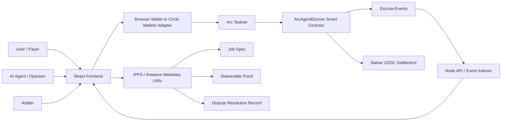

# Arc Agent Escrow Architecture

This MVP targets the **Best Agentic Economy Experience on Arc** track in the Stablecoins Commerce Stack Challenge.

## System Diagram

## Components

- **React frontend:** wallet connection, job creation, lifecycle actions, live job table, product mapping.
- **Node API/indexer:** reads Arc Testnet status and reconstructs job state from `ArcAgentEscrow` events.
- **ArcAgentEscrow contract:** native USDC escrow for agent tasks, payer approval, refund, and dispute resolution.
- **Metadata storage:** offchain URI records for job specs, deliverables, disputes, and resolution notes.

## Settlement Flow

1. Payer creates a job and locks native USDC in `ArcAgentEscrow`.
2. Agent submits a deliverable URI before the deadline.
3. Payer approves payout or opens a dispute.
4. Arbiter resolves disputed funds by assigning an agent split from 0 to 10000 bps.
5. API/indexer reads contract events and updates the frontend state.

## Circle And Arc Product Mapping

- **USDC:** primary settlement asset for escrow, payouts, refunds, and splits.
- **Arc:** execution layer for deterministic smart contract state and USDC-native gas.
- **Circle Wallets:** recommended production wallet layer for agent-initiated transactions and non-crypto-native users.
- **Nanopayments:** extension path for pay-per-inference, dataset access, API calls, or streamed usage billing.
- **CCTP / Bridge Kit:** extension path for cross-chain funding and settlement when an agent workflow starts outside Arc.

